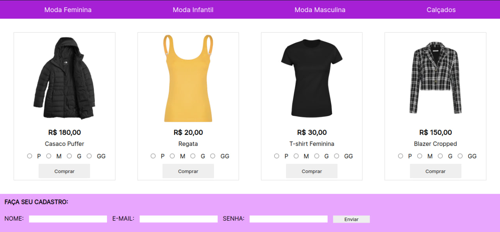

# <h1 style="text-align: center">Projeto - Loja Virtual </h1>

### Sobre

O projeto é um site simples de venda de roupas feito para desafiar os conhecimentos das alunas do curso de programação Front-End com Cloud da escola de programação Vai na Web. 

### Tecnologias Utilizadas

- HTML;
- CSS;
- Git e Github.

### Modificações

1. Hover nos botões;
2. Opacidade nas fotos.
